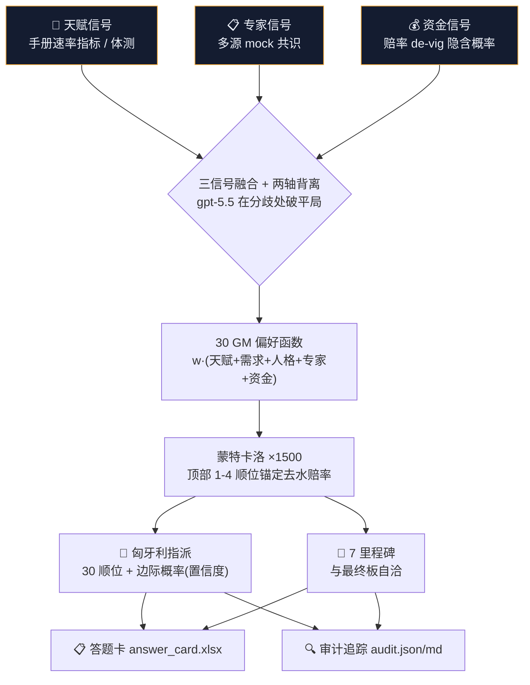

<div align="center">

# 🏀 DraftCode · 选秀作战室

**一座融合「天赋 · 专家 · 资金」三路信号、能自我推演上千次的 NBA 选秀预测 Agent**

*我们没有训练一个预测模型，而是重建了一座拥有 30 位独立人格 GM 的选秀作战室——它追踪钱的流向，把信号间的背离变成 alpha，并为每个顺位给出带置信度、可解释、可审计的预测。*


<sub>AWS Summit Shanghai 2026 · 「模拟球探」24h 黑客松 · 评分：代码 30% / 路演 30% / 预测 40%</sub>

</div>

---

## 📌 这是什么

DraftCode 把 2026 NBA 选秀预测当成一场**博弈**而非一道有标准答案的题：

- **不为「整张名单全对」优化**（概率≈0），而为**每个顺位的期望得分**优化。
- **以市场为锚、天赋为调整项**；市场再分两层——**专家（mock）+ 资金（赔率）**。
- 在**信号背离处**用 gpt-5.5 深度推理破平局——分歧，就是 alpha。

最终产物：一张可提交的**答题卡**（30 顺位 + 7 里程碑，每项带置信度）、一座**可审计**的作战室记录、一套**全 Serverless** 的 AWS 蓝图。

---

## ✨ 五大创新点

| | 创新点 | 一句话 |
|--|--|--|
| 🥇 | **三信号融合 + 两轴背离** | 天赋×专家×资金三路融合；轴①天赋vs市场、轴②专家vs资金背离触发 gpt-5.5 裁决。**钱是最快的情报。** |
| 🥈 | **30 位独立人格 GM** | 每队一个带「决策 DNA」的 GM Agent（顺位/缺口/人格/时间线）；一份模板，运行时注入 30 套人格。 |
| 🥉 | **蒙特卡洛作战室** | 自我推演 1500 次→每顺位概率分布=诚实置信度；**顶部以去水赔率为采样锚**；同批模拟顺手答 7 道里程碑。 |
| 🏅 | **实时情报 + 资金线移动** | 锁定前扫描新闻与赔率漂移，抓最后 48h 变化并重跑（字母哥交易已落地验证）。 |
| 🎖 | **红队 + 全程可审计** | 魔鬼代言人 Agent 挑战共识；每个预测产出可复现的证据档（数据/解释/背离/赔率来源）。 |

---

## 🧠 核心：三信号融合管线



> LLM 只在产偏好函数/裁决背离时**跑一次**（LLM-once）；蒙特卡洛是纯算力采样，1500 次轻松跑完——昂贵推理与廉价采样彻底解耦。

---

## 🚀 快速开始

```bash
make install      # 安装(uv,零第三方核心依赖)
make test         # 75 tests
make simulate     # 蒙特卡洛 Draft Twin(样例数据)
```

### 🏀 完整选秀预测流程（真实 2026 数据）

```bash
# 设置 gpt-5.5 网关(本地 codex 反代,或远程 EC2 网关)
export DRAFTCODE_LLM_BASE_URL=http://<gateway>:8787  DRAFTCODE_LLM_API_KEY=<key>

draftcode ingest  --source data/raw/official --out data/processed --divergence-llm   # ① 官方 107 参选人 + 轴①背离
draftcode intel   --news-text "<交易新闻>" --apply                                    # ② 实时情报换签
draftcode market  --mock-file CBS=… --mock-file SI=… --apply                          # ③ 专家共识(mock)
draftcode odds    --odds-file ESPN=… --odds-file OS=… --apply                         # ④ 资金信号(赔率 de-vig)+ 轴②背离
draftcode warroom --data-dir data/processed --output-dir outputs/llm                  # ⑤ 30 GM 偏好(gpt-5.5)
draftcode simulate --data-dir data/processed --output outputs/twin.json --draws 1500  # ⑥ 蒙特卡洛 + 赔率锚
draftcode answer  --data-dir data/processed --out outputs/answer_card.xlsx            # ⑦ 答题卡
draftcode audit   # ⑧ 合并预测+解释+背离+GM+红队 → 可审计证据档
```

> **向后兼容**：任一信号源缺失时优雅降级；不跑 `odds` 时全链路与纯天赋+专家路径**逐字节一致**。

---

## 📊 最终预测（官方板 + 已确认交易）

<table>
<tr><td valign="top">

| # | 球队 | 球员 |
|--:|--|--|
| 1 | Washington Wizards | AJ 迪班萨 |
| 2 | Utah Jazz | 达林 彼得森 |
| 3 | Memphis Grizzlies | 卡梅隆 布泽尔 |
| 4 | Chicago Bulls | 凯莱布 威尔逊 |
| 5 | Los Angeles Clippers | 基顿 瓦格勒 |
| 6 | Brooklyn Nets | 达柳斯 阿卡夫 |
| 7 | Sacramento Kings | 纳撒尼尔 阿门特 |
| 13 | **Milwaukee Bucks** ⟵ 字母哥交易 | 以赛亚 埃文斯 |

</td><td valign="top">

**7 里程碑**（与上面这张板自洽）

| 题 | 答案 |
|--|--|
| Q1 长臂展(4-14 顺位) | 3 人 |
| Q2 助跑弹跳前 3 入首轮 | 2 人 |
| Q3 首轮中锋总数 | 2 个 |
| Q4 首个中锋落点 | 第 11 顺位 |
| Q5 国际球员总数 | 3 人 |
| Q6 贡献最多机构 | 密歇根大学 |
| Q7 手掌长度前 5 入首轮 | 2 人 |

</td></tr>
</table>

> 持签球队对齐官方 30 队名单；**字母哥交易经核实为官方**（NBA.com/ESPN，密尔沃基获第 13 签）。完整 30 顺位见 `outputs/answer_card.xlsx`。

---

## 💰 资金信号 · 赔率 Agent（v3 新核心）

`draftcode odds` 把公开博彩赔率转成可融合的资金信号（仅作预测用，不构成下注建议）：

```text
美式赔率 → 隐含概率:  -X → X/(X+100)   |   +X → 100/(X+100)
去水 de-vig (比例法):  p_i = q_i / Σq_j   (同一顺位市场,消抽水使 Σp=1)
跨书共识:             多书同一(顺位,球员)取均值并按顺位归一
```

**三处接入引擎**：① 偏好叠加 `w_money·odds_signal`；② 蒙特卡洛**顶部置信度锚定市场** `(1-λ)·softmax + λ·odds`（λ 随顺位衰减）；③ **轴②背离**（专家 mock vs 资金 odds）`|gap|≥8` 触发 gpt-5.5 裁决。

实测真实赔率（ESPN + OddsShark，gpt-5.5 解析 + de-vig）：**AJ 迪班萨 0.82@1 · 威尔逊 0.81@4 · 布泽尔 0.63@3 · 彼得森 0.62@2**。当日顶部专家与资金高度同向（轴②触发 0 次=高置信锁定），裁决器仅在二者分歧时出手。

---

## 🤖 Agent 一览

| Agent | 命令 | 职责 | 产物 |
|--|--|--|--|
| 官方归一化 | `ingest` | 107 参选人 + 体测/手册 + 轴①背离(gpt-5.5) | `prospects.csv` |
| 实时情报 | `intel` | 新闻→换签/缺口(gpt-5.5)，字母哥案例验证 | `draft_order.csv` |
| 专家市场 | `market` | 多源 mock→共识(中英文名匹配) | `mock_signals.csv` |
| 资金赔率 | `odds` | 赔率→de-vig 隐含概率 + 轴②背离 | `odds_signals.csv` |
| 30 GM 作战室 | `warroom` | 30 队人格偏好 + 解释 + 红队(LLM-once) | `outputs/llm/*.json` |
| 蒙特卡洛孪生 | `simulate` | 1500 次采样 + 赔率锚 + 匈牙利指派 | `twin.json` |
| 答题卡 / 审计 | `answer` / `audit` | 提交卡 + 可复现证据档 | `answer_card.xlsx` `audit.md` |

> 所有吃外部内容的抓取都在**引擎外**（WebFetch/爬虫/人工注入文本）；引擎只做结构化、聚合、应用、审计——干净、确定、可复现。

---

## ☁️ AWS 云原生工程

全 Serverless（零 EC2 业务逻辑）+ Serverless 容器 + IaC + 全链路安全 + Well-Architected。

<details>
<summary><b>展开：架构映射 / Scenario Swarm / 部署命令</b></summary>

| 层 | 服务 |
|--|--|
| 采集(容器) | EventBridge + **Fargate**(headless 爬虫，含赔率) + ECR |
| 存储 | S3(KMS) · DynamoDB 台账(KMS) |
| 编排/模拟 | **Step Functions Distributed Map**(1000+ 蒙特卡洛并行) |
| 计算 | Lambda 容器镜像 |
| 输出 | API Gateway + Lambda |
| 安全 | KMS CMK · Secrets Manager · 最小权限 IAM · Bedrock Guardrails(条件) |
| IaC | AWS SAM(`infra/template.yaml`，`sam validate --lint` 通过) |

**Scenario Swarm**（Distributed Map 并行蒙特卡洛）：

```text
PrepareRun → N 个分片 payload → Distributed Map(action=simulate_shard)
  → 各分片写 runs/<run_id>/shards/<i>.json → Aggregate 合并 → twin.json + DynamoDB
```
每分片独立随机流 `seed + shard_index*1000003`；单分片(index 0)与本地 `run()` 逐字节等价。

**部署**：
```bash
make sam-deploy STACK_NAME=draftcode AWS_REGION=us-east-1 DATA_S3_PREFIX=processed
make upload-data S3_BUCKET=<bucket> DATA_S3_PREFIX=processed
aws stepfunctions start-execution --state-machine-arn <PredictionWorkflowArn> --region us-east-1
```
</details>

---

## 🛠️ 技术栈

`Python 3.11` · `uv` · `Typer`/`Rich` CLI · **核心引擎零第三方依赖**（`openpyxl` 仅在 official/answer 层）
`gpt-5.5`（经本地 Codex 反代 / EC2 OpenAI 兼容网关，**非 Bedrock**——账号地区受限的真实约束）
算法：赔率 de-vig · softmax 温度采样 · 蒙特卡洛 · **匈牙利指派** · 置信度加权融合

---

## 📁 仓库结构

<details>
<summary>展开</summary>

```text
src/draftcode/
  official.py     官方数据归一化 + 轴①背离
  odds.py         赔率聚合 Agent(de-vig)         intel.py / market.py  情报/专家 Agent
  divergence.py   gpt-5.5 两轴背离裁决            preference.py         三信号偏好函数
  simulate.py     蒙特卡洛 Draft Twin(+赔率锚)    warroom.py            30 GM 编排
  answer.py       答题卡 writer                  audit.py              可审计追踪合并器
  llm_client.py   gpt-5.5 客户端                 cli.py                命令行入口
infra/template.yaml   AWS SAM 蓝图
scripts/build_frontend.py  前端生成器(twin+audit → web/draft_room.html)
docs/                 架构 / 创新策略 / AWS 计分 / Agent 设计
```
</details>

---

## ⚖️ 合规与诚实说明

- 公开赔率**仅作预测信号（隐含概率）**使用，不构成、不提供任何下注建议——标准概率预测方法。
- 交易/赔率/mock 等第三方新闻**真假自行核验**（字母哥交易已 web 核实=官方）。
- gpt-5.5 采样跨 run 有波动，**缓存即任一次提交的唯一真值**；文档结果均按实测如实标注。
- 球员池严格 = 官方 107 参选人名单；不预测不可能被选的人。

<div align="center"><sub>Built for AWS Summit Shanghai 2026 · 模拟球探</sub></div>
