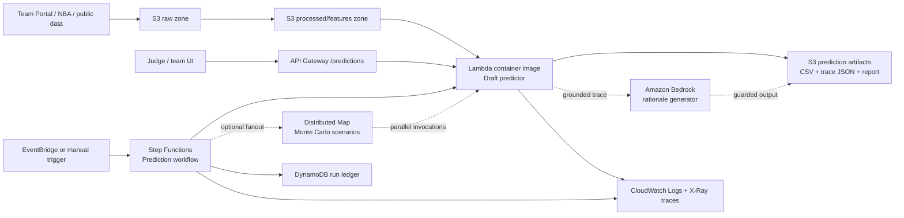

# DraftCode AWS Architecture

## One-line design

DraftCode is a serverless, auditable NBA draft intelligence pipeline: data lands in S3, Step Functions orchestrates prediction runs, a containerized Lambda executes the deterministic agent, DynamoDB records every run, and Bedrock is reserved for grounded explanations instead of unverified final decisions.

The product innovation is the **Milestone-Aware Draft Twin**: a probabilistic simulation that predicts both the 30 pick sheet and the 7 milestone questions from the same evidence graph. See `docs/innovation_strategy.md`.

## Architecture diagram

## Runtime flow

1. Raw contest and public data is stored in an encrypted S3 bucket with versioning.
2. A Step Functions state machine starts a prediction run. In the current SAM template it invokes the prediction function and writes run metadata to DynamoDB.
3. The prediction function runs as a Lambda container image. This gives us serverless operations while still allowing packaged data science dependencies and reproducible Docker builds.
4. The deterministic model produces `predictions.csv`, trace JSON, and a report. The final answer card should be copied from generated artifacts, not hand-filled.
5. Bedrock is used only after scoring to turn trace evidence into short explanations. It is not the source of truth for the picks.
6. CloudWatch and X-Ray provide logs and traceability for every run.

## Why this is not service stacking

| Need | AWS service | Reason |
| --- | --- | --- |
| No servers, fast demo endpoint | API Gateway + Lambda | Elastic request handling without EC2 maintenance. |
| Data science packaging | Lambda container image + ECR | Containerized build, serverless runtime, reproducible dependencies. |
| Auditable multi-step run | Step Functions | Visual workflow, retries, state, and service integrations. |
| Raw/processed artifact storage | S3 | Cheap, durable, versioned data lake for files and reports. |
| Run ledger and scoring audit | DynamoDB | Pay-per-request metadata store for run IDs, timestamps, and confidence summaries. |
| AI explanation | Amazon Bedrock | Generates judge-facing rationale from deterministic trace. |
| Safety boundary for AI text | Bedrock Guardrails | Keeps generated explanation bounded and reduces unsafe or irrelevant text risk. |
| Observability | CloudWatch + X-Ray | Logs, traces, latency, and failure diagnosis. |
| Repeatable deployment | AWS SAM | Infrastructure as code for the whole serverless stack. |

## Security posture

- No secrets in git. Runtime configuration is documented in `.env.example`.
- S3 blocks public access, enables server-side encryption, and versions inputs.
- DynamoDB uses server-side encryption, pay-per-request capacity, and point-in-time recovery.
- Lambda reserved concurrency limits accidental spend and protects downstream services.
- IAM policies are scoped to the data bucket, run table, Lambda invocation, and Bedrock model invocation.
- Bedrock is used behind a deterministic trace, so final picks remain explainable and reproducible.
- Competition note: the current CLI is authenticated as root. This is acceptable only as a short-lived hackathon setup; after the event, remove these credentials and use an IAM user or SSO profile.

## Well-Architected alignment

| Pillar | Design choice |
| --- | --- |
| Operational excellence | SAM template, Make targets, repeatable prediction command, Step Functions visual workflow. |
| Security | Least-privilege direction, S3 public-access block, encryption, no committed credentials, guarded AI explanations. |
| Reliability | Deterministic local fallback, Step Functions retries, versioned S3 data, DynamoDB point-in-time recovery. |
| Performance efficiency | Lambda for short runs; container image for consistent dependency startup; sequential simulator avoids overbuilt ML services. |
| Cost optimization | Serverless pay-per-use, DynamoDB on-demand, S3 lifecycle for intermediate artifacts, reserved concurrency. |
| Sustainability | No idle EC2/GPU instances; compute runs only when the Agent is invoked. |

## Deployment shape in this repo

Implemented now:

- `infra/template.yaml`: SAM template with S3, DynamoDB, containerized Lambda, API Gateway, and Step Functions.
- `Dockerfile.lambda`: Lambda container image build.
- `src/draftcode/lambda_handler.py`: supports API Gateway and direct Step Functions invocation.
- `make sam-validate`: validates the infrastructure template.

Next if time allows:

- Add S3 writeback for final prediction artifacts.
- Add milestone calculators and Monte Carlo scenario outputs.
- Add a Bedrock explanation Lambda that reads trace JSON and emits concise pick rationales.
- Add a CloudFront-hosted static report for roadshow fallback.
- Add EventBridge schedule or manual one-click workflow execution.

## Roadshow talk track

> We did not put the model on a fixed VM. DraftCode is a serverless draft intelligence pipeline. S3 keeps every raw and processed input versioned, Step Functions makes the Agent run auditable, and the prediction engine is a containerized Lambda so we get Docker reproducibility without managing EC2. DynamoDB records every run, CloudWatch and X-Ray make failures inspectable, and Bedrock is used only to explain the deterministic trace, not to hallucinate picks. That gives us elasticity, security, cost control, and a clear audit trail from data to answer card.

## Official AWS references

- AWS Lambda supports deploying functions as container images: https://docs.aws.amazon.com/lambda/latest/dg/images-create.html
- AWS Step Functions builds workflows for distributed applications and data or machine-learning pipelines: https://docs.aws.amazon.com/step-functions/latest/dg/welcome.html
- AWS Step Functions can integrate directly with AWS services: https://docs.aws.amazon.com/step-functions/latest/dg/integrate-services.html
- AWS Serverless Applications Lens documents serverless best practices: https://docs.aws.amazon.com/wellarchitected/latest/serverless-applications-lens/welcome.html
- Amazon Bedrock Guardrails provides configurable safety and privacy controls: https://docs.aws.amazon.com/bedrock/latest/userguide/guardrails.html
