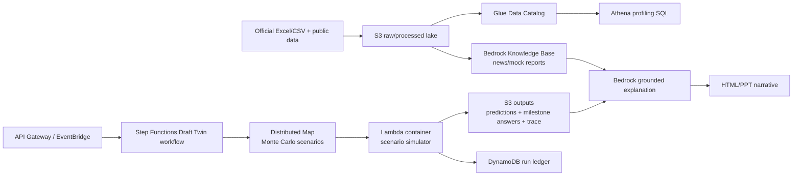

# Innovation Strategy: Milestone-Aware Draft Twin

## Verdict

The current AWS design is a solid serverless foundation, but the high-score idea should not be "we used many AWS services." The differentiated idea is:

> Build a Milestone-Aware Draft Twin: a probabilistic simulator that predicts the 30 picks and the 7 milestone questions from the same evidence graph, then produces an auditable answer card and judge-facing rationale.

This turns the scoring system itself into the product design. The model does not optimize only pick accuracy; it also estimates the exact objective events that decide 28 of the 100 points.

## Why this is the right insight

The official template shows the scoring split:

- 30 first-round picks: 72 points.
- 7 milestone questions: 28 points.

The local official data confirms:

- Player pool: 124 players.
- 26-27 candidate list: 107 players.
- Anthropometric data: 78 players.
- Strength/agility data: 78 players.
- Shooting drill data: 73 players.
- Historical draft results: 1,486 drafted players from 2001-2025.
- Historical combine table: 1,795 combine rows from 2000-2025.

The 7 milestone questions are not random trivia. They are measurable from the same player-pick distribution:

| Question | Signal family |
| --- | --- |
| Q1: long wingspan players in picks 4-14 | anthropometrics + pick range probability |
| Q2: top-3 max vertical players selected in first round | athletic testing + first-round probability |
| Q3: total centers in first round | position trend |
| Q4: first center from picks 4-30 | position trend + pick order |
| Q5: international players in first round | nationality/pathway |
| Q6: school/club with most first-round players | development pipeline concentration |
| Q7: top-5 hand length players selected in first round | hidden physical advantage |

Therefore, the strongest data idea is to model a full draft distribution, not one mock draft.

## Product concept

Draft Twin maintains three outputs from the same run:

1. **Pick sheet**: the most likely player for each team.
2. **Milestone sheet**: expected answer and confidence interval for each milestone question.
3. **Decision trace**: top alternatives, component scores, and which data source moved the decision.

This is more defensible than a pure LLM agent because every answer is grounded in structured data and reproducible scoring.

## Modeling design

### 1. Evidence graph

Each player has nodes for:

- identity: name, position, school/club, country/region.
- historical priors: how similar archetypes were drafted from 2001-2025.
- body signals: height, wingspan, standing reach, hand length/width, weight.
- athletic signals: lane agility, shuttle, 3/4 sprint, standing vertical, max vertical.
- shooting signals: off-dribble, spot-up, wing, free throw performance.
- market/team signals: consensus mocks, team needs, roster fit, reported interest.

Each team/pick has nodes for:

- pick number.
- team.
- positional need.
- risk appetite.
- historical preference if time allows.

### 2. Probability model

For each player-team-pick edge, score:

```text
P(player selected by team at pick)
  = board prior
  + pick-slot fit
  + team need
  + market/mock signal
  + physical/skill translation
  + milestone-aware scenario value
```

The important part is that milestone answers are derived from the same simulated draft distribution, not answered separately.

### 3. Monte Carlo simulator

Run many plausible drafts by sampling:

- source reliability weights.
- team need strength.
- positional scarcity.
- physical-test translation weights.
- uncertainty around players with missing combine data.

Then compute:

- most likely player by pick.
- probability each player lands in first round.
- Q1-Q7 expected answers and confidence bands.
- low-confidence picks that deserve manual data review.

## AWS architecture extension

Use AWS only where it improves the system:



### Service rationale

- **S3**: data lake for raw official files, normalized features, predictions, and traces.
- **Glue Data Catalog + Athena**: serverless analytics layer for historical priors and data-quality checks. Athena is appropriate because the data is tabular and stored in S3.
- **Step Functions Distributed Map**: runs scenario simulations in parallel without managing workers. This is the modern alternative to a fixed EC2 batch script.
- **Lambda container image**: keeps the prediction runtime reproducible while staying serverless.
- **DynamoDB**: stores run metadata, run status, confidence summary, and answer-card version.
- **Bedrock Knowledge Bases**: retrieves unstructured scouting/news/mock-draft evidence from S3 and grounds rationale generation.
- **Bedrock Guardrails**: limits the AI layer to explanation and source-grounded text, not arbitrary final answers.
- **CloudWatch/X-Ray**: provides operational evidence for code scoring and debugging.

## What to build first

### Must build today

- Normalize official data into player, combine, shooting, draft order, and answer-template tables.
- Add milestone calculators for Q1-Q7.
- Produce an answer card from generated predictions.
- Keep trace JSON for every pick and milestone answer.

### Build if time allows

- Add Monte Carlo sampling with 500-2,000 runs locally.
- Deploy Lambda container and Step Functions workflow.
- Add Bedrock explanation over trace JSON.
- Add Athena/Glue only if data is already uploaded to S3 and time remains.

## Roadshow wording

> Our innovation is not another mock draft. We built a Draft Twin that simulates the whole first round as a probability distribution. Because 28% of the score comes from milestone events, the same simulation also answers the milestone questions: long wingspan in picks 4-14, top vertical jumpers in round one, center count, international count, and school concentration. AWS makes this reproducible and auditable: S3 versions the data, Step Functions orchestrates the run, Lambda containers execute the model, DynamoDB records run metadata, and Bedrock explains only the grounded trace.

## Final recommendation

Do not pitch "we used AWS." Pitch:

> We used AWS to make a probabilistic draft decision system replayable, explainable, and cheap to rerun as new information arrives.

That is a stronger architecture story and a stronger data science story.
