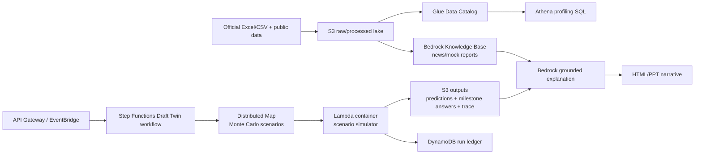

# Innovation Strategy: Milestone-Aware Draft Twin

## Verdict

The current AWS design is a solid serverless foundation, but the high-score idea should not be "we used many AWS services." The differentiated idea is:

> Build a Milestone-Aware Draft Twin: a probabilistic simulator that predicts the 30 picks and the 7 milestone questions from the same evidence graph, then produces an auditable answer card and judge-facing rationale.

This turns the scoring system itself into the product design. The model does not optimize only pick accuracy; it also estimates the exact objective events that decide 28 of the 100 points.

## Why this is the right insight

The official template shows the scoring split:

- 30 first-round picks: 72 points.
- 7 milestone questions: 28 points.

The local official data confirms:

- Player pool: 124 players.
- 26-27 candidate list: 107 players.
- Anthropometric data: 78 players.
- Strength/agility data: 78 players.
- Shooting drill data: 73 players.
- Historical draft results: 1,486 drafted players from 2001-2025.
- Historical combine table: 1,795 combine rows from 2000-2025.

The 7 milestone questions are not random trivia. They are measurable from the same player-pick distribution:

| Question | Signal family |
| --- | --- |
| Q1: long wingspan players in picks 4-14 | anthropometrics + pick range probability |
| Q2: top-3 max vertical players selected in first round | athletic testing + first-round probability |
| Q3: total centers in first round | position trend |
| Q4: first center from picks 4-30 | position trend + pick order |
| Q5: international players in first round | nationality/pathway |
| Q6: school/club with most first-round players | development pipeline concentration |
| Q7: top-5 hand length players selected in first round | hidden physical advantage |

Therefore, the strongest data idea is to model a full draft distribution, not one mock draft.

## Product concept

Draft Twin maintains three outputs from the same run:

1. **Pick sheet**: the most likely player for each team.
2. **Milestone sheet**: expected answer and confidence interval for each milestone question.
3. **Decision trace**: top alternatives, component scores, and which data source moved the decision.

This is more defensible than a pure LLM agent because every answer is grounded in structured data and reproducible scoring.

## Modeling design

### 1. Evidence graph

Each player has nodes for:

- identity: name, position, school/club, country/region.
- historical priors: how similar archetypes were drafted from 2001-2025.
- body signals: height, wingspan, standing reach, hand length/width, weight.
- athletic signals: lane agility, shuttle, 3/4 sprint, standing vertical, max vertical.
- shooting signals: off-dribble, spot-up, wing, free throw performance.
- market/team signals: consensus mocks, team needs, roster fit, reported interest.

Each team/pick has nodes for:

- pick number.
- team.
- positional need.
- risk appetite.
- historical preference if time allows.

### 2. Probability model

For each player-team-pick edge, score:

```text
P(player selected by team at pick)
  = board prior
  + pick-slot fit
  + team need
  + market/mock signal
  + physical/skill translation
  + milestone-aware scenario value
```

Innovation point 1 is a cache-backed gpt-5.5 divergence adjudicator inside
`draftcode ingest`. For handbook players with `abs(divergence_gap) >= 8`, the
pipeline asks gpt-5.5 whether the split is `market_hype`, `talent_undervalued`,
or `true_split`, persists the verdict in `divergence_llm.json`, and uses
`confidence` to blend the existing deterministic market weight with
`adjusted_market_weight`. The no-cache/no-LLM path keeps the original arithmetic.

The concrete test case is 达林·彼得森: `talent_rank=14` versus `market_rank=1.5`,
which the deterministic rule labels `market_hype`. From neutral measurables alone
(the rule verdict is never leaked into the prompt), gpt-5.5 adjudicates and is
cached once for determinism. On the official 107-entrant pool it flagged 7 large
splits and returned `true_split` for all 7 — including Peterson (market weight
0.52, confidence 0.63), finding both the efficient-big-guard talent case and the
market's enthusiasm credible. The adjudicator is deliberately conservative: it
nudges fused scores by confidence-weighted amounts instead of swinging ranks, and
every verdict + reasoning is persisted for audit. (gpt-5.5 sampling varies between
runs; an earlier 124-pool run returned `talent_undervalued` for Peterson, so the
cache is the source of truth for any given submission.)

Innovation point 2 lands as a deterministic LLM-once GM layer: `draftcode warroom`
asks gpt-5.5 once per team for small candidate deltas, caches them in
`outputs/llm/gm_preferences.json`, and `draftcode simulate` reads that static JSON
while sampling. The edge score becomes `deterministic_preference_score + 0.50 *
clamp(gm_delta, -0.08, 0.08)`, so fixed inputs plus fixed cache bytes reproduce
the same Monte Carlo output without another LLM call.

The important part is that milestone answers are derived from the same simulated draft distribution, not answered separately.

### 3. Monte Carlo simulator

Run many plausible drafts by sampling:

- source reliability weights.
- team need strength.
- positional scarcity.
- physical-test translation weights.
- uncertainty around players with missing combine data.

Then compute:

- most likely player by pick.
- probability each player lands in first round.
- Q1-Q7 expected answers and confidence bands.
- low-confidence picks that deserve manual data review.

## AWS architecture extension

Use AWS only where it improves the system:



### Service rationale

- **S3**: data lake for raw official files, normalized features, predictions, and traces.
- **Glue Data Catalog + Athena**: serverless analytics layer for historical priors and data-quality checks. Athena is appropriate because the data is tabular and stored in S3.
- **Step Functions Distributed Map**: runs scenario simulations in parallel without managing workers. This is the modern alternative to a fixed EC2 batch script.
- **Lambda container image**: keeps the prediction runtime reproducible while staying serverless.
- **DynamoDB**: stores run metadata, run status, confidence summary, and answer-card version.
- **Bedrock Knowledge Bases**: retrieves unstructured scouting/news/mock-draft evidence from S3 and grounds rationale generation.
- **Bedrock Guardrails**: limits the AI layer to explanation and source-grounded text, not arbitrary final answers.
- **CloudWatch/X-Ray**: provides operational evidence for code scoring and debugging.

## What to build first

### Must build today

- Normalize official data into player, combine, shooting, draft order, and answer-template tables.
- Add milestone calculators for Q1-Q7.
- Produce an answer card from generated predictions.
- Keep trace JSON for every pick and milestone answer.

### Build if time allows

- Add Monte Carlo sampling with 500-2,000 runs locally.
- Deploy Lambda container and Step Functions workflow.
- Add Bedrock explanation over trace JSON.
- Add Athena/Glue only if data is already uploaded to S3 and time remains.

## AWS 全链路安全 (well-architected)

`infra/template.yaml` hardens the serverless data plane:

- **Customer-managed KMS CMK** (`DraftCodeKey`, rotation on) encrypts the S3
  artifact bucket (`aws:kms` + bucket keys), the DynamoDB run ledger, and the
  gpt-5.5 gateway secret. Every role that touches encrypted data carries a
  least-privilege `kms:Decrypt`/`GenerateDataKey` grant scoped to the key ARN.
- **Secrets Manager** holds the gpt-5.5 gateway bearer token (CMK-encrypted,
  generated — never committed); the Lambda gets `secretsmanager:GetSecretValue`
  on that one secret only.
- **Encryption in transit**: an S3 bucket policy denies any non-TLS request.
- **Least-privilege IAM**: the Scenario Swarm Distributed-Map permission was
  narrowed from `states:*` on `"*"` to this state machine's own
  `stateMachine:ScenarioSwarmWorkflow*` / `execution:...*` ARNs.
- **Bedrock Guardrail** (content + PII filters) ships behind a default-off
  `EnableBedrockGuardrail` condition, ready for the host account that has Bedrock
  enabled (this personal account is region-blocked).

Validated with `sam validate --lint`. The live stack still runs the prior AES256
build; this CMK/secrets revision is deploy-ready (`make sam-deploy`) and
intentionally not re-applied right before the deadline to avoid disturbing the
working deployment.

## Roadshow wording

> Our innovation is not another mock draft. We built a Draft Twin that simulates the whole first round as a probability distribution. Because 28% of the score comes from milestone events, the same simulation also answers the milestone questions: long wingspan in picks 4-14, top vertical jumpers in round one, center count, international count, and school concentration. AWS makes this reproducible and auditable: S3 versions the data, Step Functions orchestrates the run, Lambda containers execute the model, DynamoDB records run metadata, and Bedrock explains only the grounded trace.

## Final recommendation

Do not pitch "we used AWS." Pitch:

> We used AWS to make a probabilistic draft decision system replayable, explainable, and cheap to rerun as new information arrives.

That is a stronger architecture story and a stronger data science story.
